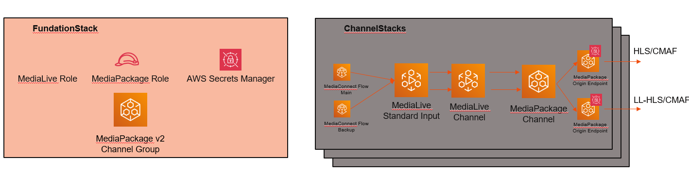

# AWS Live Streaming CDK Multi-Channel Solution

Enterprise-grade multi-channel live streaming infrastructure using AWS MediaConnect, MediaLive, and MediaPackage V2 with automated deployment and lifecycle management.



## 🏗️ Architecture Overview

This solution deploys a scalable, multi-channel live streaming infrastructure with three main stack types:

- **CleanupStack**: Manages automatic deletion of removed channel stacks
- **FoundationStack**: Shared resources (MediaPackage V2 Channel Group, IAM roles, Secrets)
- **ChannelStack**: Per-channel resources with full redundancy

## 🚀 Quick Start

### Prerequisites
- AWS CLI configured
- Node.js 18+ and npm
- AWS CDK v2 installed globally

### Deployment

```bash
# Install dependencies
npm install

# Deploy all stacks (recommended)
cdk deploy --require-approval never --all

# Or deploy individually
cdk deploy SPL-Live-CleanupStack
cdk deploy SPL-Live-FoundationStack
cdk deploy SPL-Live-ChannelStack-CH01
```

## ⚙️ Configuration

Edit `config/encoding-profiles/config.ts` to manage your channels:

```typescript
export const config = {
  channels: [
    {
      name: 'CH01',
      mediaConnect: {
        autoStart: false,        // Auto start/stop flows
        mainAZ: 'me-central-1a',
        backupAZ: 'me-central-1b',
        mainIngestPort: 20100,
        backupIngestPort: 20101,
        whitelistCidr: "0.0.0.0/0",
        decryption: false
      },
      mediaLive: {
        autoStart: false,        // Auto start/stop channel
        channelClass: "STANDARD",
        inputType: "MEDIACONNECT",
        codec: "AVC",
        encodingProfile: "HD-1080p"
      },
      mediaPackage: {
        ingestType: "CMAF",
        hlsSegmentDurationSeconds: 4,
        cmafSegmentDurationSeconds: 4
        // ... additional settings
      }
    }
  ]
};
```

### Adding/Removing Channels

1. **Add Channel**: Add new channel object to `config.channels` array
2. **Remove Channel**: Remove channel from `config.channels` array
3. **Deploy**: Run `cdk deploy --require-approval never --all`

✅ **Automatic Stack Management**: Removed channels trigger automatic stack deletion

## 📦 Stack Resources

### CleanupStack
- Lambda function for automatic stack lifecycle management
- SSM Parameter Store for tracking deployed channels
- CloudFormation stack deletion automation

### FoundationStack (Shared)
- **MediaPackage V2 Channel Group**: `DAWRI-STREAMING-GROUP-CDK`
- **IAM Roles**: MediaLive + MediaPackage with least-privilege permissions
- **Secrets Manager**: CDN authentication secrets
- **Foundation Protection**: Prevents deletion while channels exist

### ChannelStack (Per Channel)
- **MediaConnect**: 2 SRT flows (main + backup, multi-AZ)
- **MediaLive**: Input + Channel with HD encoding profiles
- **MediaPackage V2**: Channel + CMAF endpoint with CDN auth
- **Custom Resources**: 
  - Auto start/stop for MediaConnect flows
  - Auto start/stop for MediaLive channels
  - Ingest endpoint extraction to SSM
- **Outputs**: Playback URLs, ingest endpoints, resource ARNs

## 🔧 Key Features

### 🔄 Automated Lifecycle Management
- **Auto Start/Stop**: Configure `autoStart: true/false` for MediaConnect and MediaLive
- **Stack Cleanup**: Automatic deletion of removed channel stacks
- **Dependency Management**: Proper deletion order with foundation protection

### 🛡️ High Availability & Security
- **Multi-AZ Redundancy**: MediaConnect flows across availability zones
- **SRT Protocol**: Secure, low-latency ingest
- **CDN Authentication**: Token-based content protection
- **IAM Best Practices**: Least-privilege access policies

### 📊 Monitoring & Observability
- **CloudWatch Logs**: Structured logging for all Lambda functions
- **SSM Parameters**: Centralized configuration and endpoint storage
- **Stack Dependencies**: Clear resource relationships and dependencies

## 🔍 CloudWatch Log Insights

Query User-Agent popularity:
```sql
fields @timestamp, @message
| parse @message /User-Agent: (?<user_agent>[^"]*)/
| stats count(*) by user_agent
| sort count desc
```

## 🚨 Troubleshooting

### Common Issues

**Log Group Already Exists**: 
- Fixed with explicit log group management and `RemovalPolicy.DESTROY`

**Stack Deletion Dependencies**: 
- Foundation stack protected until all channel stacks are deleted
- Cleanup stack handles proper deletion order

**Cross-Stack Export Errors**: 
- Channel stacks must be deleted before foundation stack
- Use `cdk destroy --all` or delete in reverse dependency order

## 📝 Development

```bash
# Build TypeScript
npm run build

# Run tests
npm test

# Watch mode
npm run watch

# CDK commands
cdk diff           # Show changes
cdk synth          # Generate CloudFormation
cdk destroy --all  # Delete all stacks
```

## 🏷️ Resource Naming Convention

- **Stacks**: `SPL-Live-{StackType}-{ChannelName}`
- **Functions**: `{StackName}_{ServiceType}_{Action}`
- **Parameters**: `{StackName}-{ResourceType}`

## 📄 License

This project is licensed under the Apache License 2.0.

---

**Built with AWS CDK v2 | TypeScript | Python**